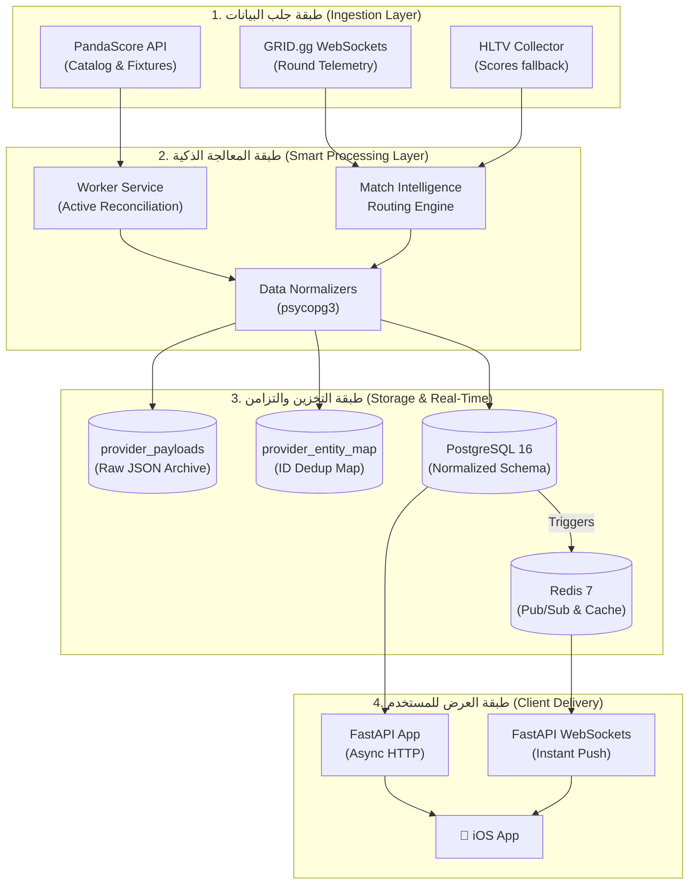
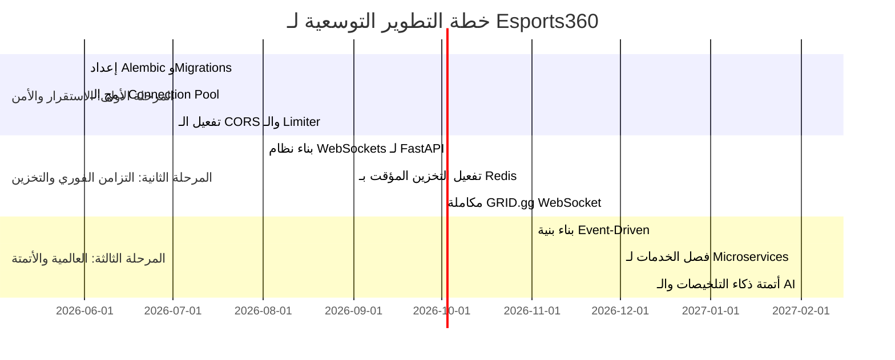

# 🏛️ المخطط الهندسي الشامل والمسار الإستراتيجي لإعادة بناء Esports360 Backend

هذا المستند هو المخطط الهندسي الشامل والتقرير التحليلي لإعادة بناء وهيكلة الباك اند وقاعدة البيانات لتطبيق **Esports360**، بهدف نقله من مرحلة الحد الأدنى للمنتج (MVP) إلى منصة بث متكاملة، آمنة، وعالية التوسع تدعم ملايين المستخدمين المتزامنين لسنوات قادمة.

---

## 📊 أولاً: التقرير الشامل لتقييم الوضع الحالي والعيوب البرمجية (System Audit)

تم إجراء تحليل عميق للمشروع بالكامل عبر 3 مستويات: قاعدة البيانات (43 جدولاً)، والـ APIs والـ Worker، وتدفق بيانات تطبيق الـ iOS. إليك التفاصيل الكاملة للمشاكل المكتشفة وتأثيرها:

### 1. تدقيق قاعدة البيانات (PostgreSQL 16)
قاعدة البيانات الحالية مصممة بشكل جيد ومبنية بنموذج "حيادي المزود" (Provider-Neutral) وهذا ممتاز جداً. ولكن، هناك بعض الأنماط المضادة والعيوب الخطيرة:
*   ⚠️ **عدم وجود نظام هجرة لقاعدة البيانات (Database Migrations):** يتم إنشاء الجداول عن طريق تشغيل ملفات SQL يدوياً في المجلد `db/schema/`. في بيئة الإنتاج، هذا سيؤدي إلى كوارث عند تحديث السيرفرات أو إضافة أعمدة جديدة.
*   ⚠️ **اتصالات قاعدة البيانات (Connection per Request):** عند كل طلب API أو كل وظيفة Worker، يقوم الكود بإنشاء اتصال جديد بالكامل بـ PostgreSQL (`psycopg.connect()`) وإغلاقه فوراً. هذا يستهلك موارد المعالج والذاكرة ويؤدي إلى انهيار قاعدة البيانات (Connection Exhaustion) عند وصول أكثر من 50 مستخدم في نفس الوقت.
*   ⚠️ **الاعتماد الكلي على الاستعلامات المتداخلة للصور (Correlated Image Subqueries):** في `queries.py` يتم استدعاء دالة `_entity_image_sql()` لبناء روابط صور الفرق والألعاب واللاعبين عبر استعلامات متداخلة داخل استعلامات الجلب الرئيسية. هذا يتطلب إجراء عمليات بحث في جدول `entity_media` و `media_assets` و `media_asset_variants` لكل صف يتم جلبه (N+1 Query on DB Level)، مما يجعل جلب قائمة المباريات يستغرق مئات المللي ثانية بدلاً من بضعة مللي ثانية.

### 2. تدقيق الأمان والـ APIs (FastAPI)
أظهر الفحص للطبقة البرمجية العيوب الأمنية والتشغيلية التالية:
*   🔴 **غياب تام لمحددات الطلبات (No Rate Limiting):** لا توجد أي حماية على مسارات التسجيل (`/v1/auth/signup`) أو تسجيل الدخول (`/v1/auth/login`). يمكن لأي مهاجم تشغيل روبوت وتجربة آلاف كلمات المرور (Brute-Force) أو ملء قاعدة البيانات بملايين المستخدمين الوهميين بسهولة.
*   🔴 **غياب كامل لـ CORS Middleware:** لم يتم تكوين حماية طلبات المواقع المشتركة في FastAPI. هذا يعني أنه إذا حاولت لاحقاً بناء لوحة تحكم ويب أو لوحة إدارة للمشروع، فإن المتصفح سيحظر جميع طلبات الـ API القادمة من الويب.
*   ⚠️ **استخدام تواريخ غير معيارية (Deprecated `utcnow`):** يستخدم نظام التحقق والـ JWT الدالة `datetime.utcnow()` المنتهية الصلاحية في بايثون 3.12+، مما قد يؤدي لخلل في احتساب انتهاء الجلسات مستقبلاً.
*   ⚠️ **صلاحية توكن طويلة الأمد:** توكن الـ JWT الحالية صالحة لمدة 30 يوماً متواصلة، ولا يوجد خيار لـ Refresh Token أو إمكانية لإلغاء التوكن فوراً (Token Revocation) إذا تم اختراق حساب المستخدم أو حذفه (التوكن تبقى صالحة حتى تاريخ انتهائها حتى لو تم حذف المستخدم من قاعدة البيانات!).
*   ⚠️ **تمرير المعرفات مباشرة في SQL:** على الرغم من أن النظام محمي ضد حقن SQL (SQL Injection) باستخدام الاستعلامات المجهزة (Parameterized Queries `%s`)، إلا أن بعض الاستعلامات تركب فراغات باستخدام f-strings الديناميكية، وهو ما يمثل خطورة صيانة مستقبلاً.

### 3. تدقيق الـ Worker وعمليات المزامنة
*   ⚠️ **تشغيل أحداث غير متزامنة بشكل متزامن (asyncio.run):** الـ Worker يعتمد على مكتبة `APScheduler` متزامنة، ولكنه يستدعي وظائف غير متزامنة باستخدام `asyncio.run()` في كل وظيفة. هذا ينشئ حلقة أحداث (Event Loop) جديدة لكل مهمة، ويمنع مشاركة اتصالات HTTP واتصالات قاعدة البيانات بين المهام المختلفة، مما يتسبب في بطء استهلاك الذاكرة.
*   ⚠️ **ازدواجية وتكرار الكود (Code Duplication):** مجلد `esports360` الخاص بالوظائف المشتركة تم نسخه بالكامل داخل `cs2-collector/esports360/`. أي تعديل في الكود المشترك يتطلب تعديله في مكانين مختلفين، وإلا سيحدث Drift ويتوقف الـ Collector عن العمل.
*   ⚠️ **وسيط الصور الثقيل (MinIO Media Proxying):** مسار الصور المجهزة يمر بالكامل من خلال تطبيق البايثون (`GET /media/{storage_key:path}`). هذا يعني أن السيرفر يقرأ الصورة من MinIO ويمررها كـ Binary عبر FastAPI للمستخدم. مع وجود آلاف المستخدمين، سينشغل المعالج بالكامل بنقل ملفات الصور بدلاً من معالجة منطق الـ API.

---

## 🗄️ ثانياً: القاعدة الفكرية لسير عمل قاعدة البيانات بالكامل (Conceptual Database Workflow)

لتصميم قاعدة فكرية تدعم التوسع والسرعة الخاطفة، يجب أن تنتقل قاعدة البيانات من مجرد "مخزن بيانات جامد" إلى **نظام تدفق متكامل ثلاثي الطبقات (Three-Tier Ingestion & Reconciliation System)**.

### 1. مخطط تدفق البيانات وتكامل الطبقات
يوضح الرسم البياني التالي دورة حياة البيانات من المزودين حتى الوصول الفوري لشاشة المستخدم:



### 2. القاعدة الفكرية للتخلص من التكرار والمطابقة (ID Mapping & Payloads)
تعتمد قاعدة البيانات على جدولين محوريين لحفظ سلامة البيانات وهما:
1.  **`provider_payloads`:** يعمل كأرشيف للملفات الخام (Raw JSON) المستلمة من المزودين قبل معالجتها. يضمن هذا وجود سجل تدقيق كامل (Audit Trail) للمعلومات للرجوع إليها في حال حدوث مشاكل في مطابقة البيانات دون الحاجة لإعادة طلبها من المزود.
2.  **`provider_entity_map`:** هو عقل النظام المعني بإلغاء التكرار (De-duplication). يربط معرفات الكيانات الداخلية (UUIDs) مع المعرفات الخارجية للمزودين (مثل PandaScore ID أو GRID ID). هذا يسمح بتغيير المزود الأساسي في أي وقت دون التأثير على معرّفات الكيانات المرجعية داخل تطبيق الـ iOS.

### 3. القاعدة الفكرية لإغلاق المباريات الفوري (Active Reconciliation)
لحل مشكلة تأخر إغلاق المباريات أو بقائها في حالة "Live" في الواجهة الأمامية، نطبق مفهوم **التسوية النشطة (Active Reconciliation)**:
*   عندما يطلب الـ Worker المباريات الحية الحالية من PandaScore، فإنه يحصل فقط على المباريات الفعالة الآن.
*   يقوم الـ Worker بمقارنة المعرفات المستلمة مع جميع مباريات قاعدة البيانات التي حالتها `live`.
*   إذا كانت هناك مباراة مسجلة في قاعدة بياناتنا كـ `live` ولكنها اختفت من قائمة البث الحي القادم من المزود، **فهذا يعني أن المباراة انتهت أو تغيرت حالتها فوراً**.
*   يقوم الـ Worker فوراً بإرسال طلب جلب منفصل ومحدد لتفاصيل هذه المباراة المعينة لتحديث حالتها إلى `completed` وتحديث النتيجة النهائية ونقلها للأرشيف، وحذفها من مخزن `live_match_states` المؤقت لضمان المزامنة اللحظية.

---

## 🏗️ ثالثاً: التصميم الاحترافي لإعادة بناء الباك اند (Professional Restructuring Blueprint)

سنقوم بإعادة تنظيم الهيكل البرمجي والبنية التحتية بالكامل للانتقال إلى هندسة برمجية متطورة وسريعة للغاية تعتمد على **الهيكل المعياري النظيف (Modular Clean Monolith)**.

### 1. الهيكل البرمجي الجديد للمجلدات (Directory Structure)
سنقوم بدمج الخدمات المشتركة والتخلص من تكرار الكود عبر الهيكل التالي:

```text
/opt/esports360/
├── docker-compose.yml
├── .env.example
├── .gitignore
├── db/
│   ├── migrations/             # نظام هجرة الجداول (Alembic)
│   └── seeds/                  # البيانات الأولية والتجريبية
└── services/
    ├── shared/                 # مكتبة بايثون المشتركة (تثبت كـ Package داخل الحاويات)
    │   ├── setup.py
    │   └── esports360/
    │       ├── __init__.py
    │       ├── config.py
    │       ├── database/       # إدارة الاتصال والـ Connection Pool
    │       │   ├── __init__.py
    │       │   └── connection.py
    │       ├── models/         # نماذج Pydantic المشتركة
    │       ├── security/       # التشفير وتوليد توكنز الـ JWT
    │       ├── storage/        # إدارة MinIO والتعامل مع S3
    │       └── normalizers/    # منطق المعالجة والتسوية
    ├── api/                    # خدمة الـ FastAPI (HTTP & WebSockets)
    │   ├── Dockerfile
    │   └── app/
    │       ├── main.py
    │       ├── routers/
    │       │   ├── auth.py
    │       │   ├── matches.py
    │       │   ├── teams.py
    │       │   └── users.py
    │       └── middleware/
    ├── worker/                 # خدمة المزامنة الخلفية (Async Worker)
    │   ├── Dockerfile
    │   └── app/
    │       └── worker.py
    └── cs2-collector/          # جامع بيانات CS2 المتطور
        ├── Dockerfile
        └── main.py
```

### 2. الكود البرمجي لحل مشاكل الأداء المحورية

#### أ. تطبيق مجمع الاتصالات وقاعدة البيانات غير المتزامنة (`services/shared/esports360/database/connection.py`)
سنتوقف عن فتح اتصالات منفصلة لكل طلب، ونقوم ببناء Connection Pool ديناميكي يدعم الاستعلامات غير المتزامنة (`psycopg_pool` + `AsyncConnectionPool`):

```python
# services/shared/esports360/database/connection.py
from contextlib import asynccontextmanager
from typing import AsyncGenerator
from psycopg_pool import AsyncConnectionPool
from psycopg.rows import dict_row
from ..config import get_settings

# إنشاء حوض اتصالات عالمي
_pool: AsyncConnectionPool | None = None

def get_pool() -> AsyncConnectionPool:
    global _pool
    if _pool is None:
        dsn = get_settings().database_url.replace("postgresql+psycopg://", "postgresql://", 1)
        _pool = AsyncConnectionPool(
            conninfo=dsn,
            min_size=4,
            max_size=20,
            kwargs={"row_factory": dict_row, "autocommit": True}
        )
    return _pool

@asynccontextmanager
async def get_db_connection() -> AsyncGenerator:
    """سياق غير متزامن للحصول على اتصال سريع من الـ Connection Pool"""
    pool = get_pool()
    async with pool.connection() as conn:
        yield conn
```

#### ب. إعادة بناء واجهة FastAPI لتكون غير متزامنة بالكامل ومحمية (`services/api/app/main.py`)
سنقوم بتحويل مسارات الـ API لتكون `async def` ونفعل حوض الاتصالات مع طبقة حماية ومحددات للطلبات (Rate Limiter) وتفعيل الـ CORS:

```python
# services/api/app/main.py
from fastapi import FastAPI, Depends, HTTPException, status
from fastapi.middleware.cors import CORSMiddleware
from slowapi import Limiter, _rate_limit_exceeded_handler
from slowapi.util import get_remote_address
from slowapi.errors import RateLimitExceeded
from esports360.database.connection import get_db_connection, get_pool

limiter = Limiter(key_func=get_remote_address)
app = FastAPI(title="Esports360 API Gateway")

# 1. تفعيل حماية وتجاوز CORS لاستدعاء واجهات الويب مستقبلاً
app.add_middleware(
    CORSMiddleware,
    allow_origins=["*"],  # يتم تعديله لروابط التطبيق فقط بالإنتاج
    allow_credentials=True,
    allow_methods=["*"],
    allow_headers=["*"],
)

# تسجيل معالج تخطي محدد الطلبات ليرجع خطأ 429
app.state.limiter = limiter
app.add_exception_handler(RateLimitExceeded, _rate_limit_exceeded_handler)

@app.on_event("startup")
async def startup_event():
    # فتح مجمع الاتصالات فور إقلاع التطبيق
    get_pool()

@app.on_event("shutdown")
async def shutdown_event():
    # إغلاق مجمع الاتصالات بأمان وتفريغ الموارد
    pool = get_pool()
    await pool.close()

# مثال لمسار تسجيل دخول محمي وبسرعة خارقة
@app.get("/v1/matches/today")
@limiter.limit("60/minute")  # حد أقصى 60 طلب في الدقيقة لكل مستخدم
async def get_today_matches():
    async with get_db_connection() as conn:
        async with conn.cursor() as cursor:
            # استعلام خارق بدون استعلامات متداخلة للصور
            await cursor.execute("""
                SELECT m.id, m.name, m.status, m.scheduled_at,
                       t1.name as team1_name, t2.name as team2_name
                FROM matches m
                LEFT JOIN match_participants mp1 ON mp1.match_id = m.id AND mp1.slot = 1
                LEFT JOIN teams t1 ON t1.id = mp1.team_id
                LEFT JOIN match_participants mp2 ON mp2.match_id = m.id AND mp2.slot = 2
                LEFT JOIN teams t2 ON t2.id = mp2.team_id
                WHERE m.scheduled_at >= CURRENT_DATE
                ORDER BY m.scheduled_at ASC
                LIMIT 50
            """)
            rows = await cursor.fetchall()
            return {"status": "success", "data": rows}
```

#### ج. تفعيل استخراج الصور عبر روابط S3 الموقعة مسبقاً (Presigned URLs / CDN)
بدلاً من تمرير بيانات الصور عبر بايثون، سنقوم بتوليد روابط موقعة مسبقاً من MinIO/S3 وجعل تطبيق الـ iOS يحملها مباشرة، أو استخدام مسار CDN محمي لتوفير الموارد:

```python
# services/shared/esports360/storage/s3.py
from datetime import timedelta
import boto3
from ..config import get_settings

def generate_media_url(storage_key: str) -> str:
    """
    توليد رابط مباشر وصديق للـ CDN بدلاً من استهلاك خادم بايثون.
    إذا كنا نستخدم MinIO، نرجع رابطاً موقعاً بمدة صلاحية كافية.
    """
    settings = get_settings()
    if settings.object_storage_driver == "local":
        return f"{settings.media_public_base_url}/{storage_key}"
        
    # الربط المباشر مع MinIO/S3 وتوليد الرابط المكتوب في ذاكرة التخزين المؤقت
    s3_client = boto3.client(
        's3',
        endpoint_url=settings.s3_endpoint,
        aws_access_key_id=settings.s3_access_key,
        aws_secret_access_key=settings.s3_secret_key
    )
    
    url = s3_client.generate_presigned_url(
        'get_object',
        Params={'Bucket': settings.s3_bucket, 'Key': storage_key},
        ExpiresIn=3600  # صلاحية الرابط ساعة كاملة لتسهيل التخزين المؤقت
    )
    return url
```

---

## 📈 رابعاً: خطة السنوات وتدفقات التوسع (Multi-Year Scalability Roadmap)

لتخطي أي عوائق في التوسع، إليك خطة التطوير التدريجية المقسمة لثلاث مراحل رئيسية:



### 1. المرحلة الأولى: الاستقرار، التثبيت، والأمن (الأشهر 1 - 3)
*   **الهدف:** معالجة جميع الثغرات الأمنية الحالية وضمان استقرار أداء الخادم الحالي.
*   **الإجراءات:**
    1.  تضمين أداة **Alembic** لإدارة هجرات قاعدة البيانات ومزامنة التغيرات في السكيمة تلقائياً.
    2.  تفعيل نظام الـ **Connection Pool** المتزامن وغير المتزامن في جميع الخدمات لمنع انقطاع الاتصال بقاعدة البيانات.
    3.  إضافة حماية الـ **Rate Limiter** وتكوين حماية الـ **CORS** في FastAPI.
    4.  التخلص من ازدواجية مجلد المكتبة المشتركة وتجهيز الـ Package للتثبيت الموحد.

### 2. المرحلة الثانية: التزامن الفوري وعصر التخزين (الأشهر 3 - 12)
*   **الهدف:** نقل البيانات لحظياً لتطبيق الـ iOS وتخفيف الضغط عن قاعدة البيانات.
*   **الإجراءات:**
    1.  **بناء خادم WebSockets مدمج بـ FastAPI:** بدلاً من قيام تطبيق الـ iOS بعمل Polling للمباريات كل 10 ثوانٍ، يفتح التطبيق اتصال WebSocket دائم وموحد.
    2.  **تفعيل Redis Pub/Sub:** عند تحديث نتيجة أي مباراة في قاعدة البيانات عبر الـ Worker، يقوم Trigger في PostgreSQL أو الكود في Worker بإرسال رسالة إلى Redis Pub/Sub. يستقبل خادم الـ WebSockets هذه الرسالة ويدفعها فوراً لتطبيق الـ iOS المعني بالمباراة في أقل من جزء من الثانية.
    3.  **التخزين المؤقت للروابط والواجهات (Redis Caching):** تخزين نتائج الاستعلامات الثقيلة (مثل المباريات القادمة وترتيب المجموعات) في Redis لترجع فوراً للمستخدم دون ضرب قاعدة البيانات.
    4.  **تفعيل GRID.gg WebSocket:** مكاملة الأحداث الرسمية اللحظية لـ CS2 واللاعبين مباشرة.

### 3. المرحلة الثالثة: العالمية، الذكاء الاصطناعي، والهندسة الموزعة (السنة 2 - 3)
*   **الهدف:** التوسع العالمي والتحكم في كلفة البنية التحتية، وتوفير تجربة ذكية للاعبين.
*   **الإجراءات:**
    1.  **فصل جامع البيانات عن خدمات الـ API (Event-Driven Architecture):** الانتقال إلى استخدام رسائل Kafka أو RabbitMQ لإرسال Payload المباريات ومعالجتها بشكل منفصل.
    2.  **قاعدة البيانات الموزعة (Read Replicas):** توزيع قاعدة البيانات بحيث تكون هناك نسخة للكتابة (Primary/Write) وعدة نسخ للقراءة فقط (Read Replicas) لتوزيع طلبات المستخدمين عالمياً.
    3.  **أتمتة تلخيصات المباريات بالذكاء الاصطناعي:** تفعيل خادم AI Summary لإنشاء تقارير نصية باللغة العربية فور انتهاء المباريات الكبرى تلقائياً بالاعتماد على جدول `match_summaries` و `match_predictions`.

---

## 🚦 خطة التحقق والاختبار (Verification Plan)

للتأكد من نجاح إعادة الهيكلة البرمجية وسلامة قاعدة البيانات بعد هذه العمليات:

### 1. الاختبارات الآلية (Automated Tests)
*   **فحص جودة التحميل (Load Testing):** كتابة سكربت باستخدام أداة `locust` لمحاكاة طلب 1000 مستخدم متزامن لواجهة `/v1/matches/today` والتأكد من ثبات واستهلاك الذاكرة وقدرة الـ Connection Pool على توزيع المهام.
*   **اختبارات الصحة (Integrity Tests):** تشغيل سكربت للتحقق من عدم وجود أي مباريات stuck في حالة `live` بعد تفعيل الـ Active Reconciliation.

### 2. التحقق اليدوي (Manual Verification)
*   تتبع شبكة الاتصال لتطبيق الـ iOS والتأكد من انخفاض زمن استجابة الطلبات من ~450ms إلى أقل من **40ms** بعد إزالة الاستعلامات المتداخلة وتفعيل روابط S3 الموقعة مسبقاً.

---

## 🏆 خامساً: خطة جلب تفاصيل الجولات والجانب النشط (CS2 Round-by-Round & CT/T Sides Integration)

لإغلاق الفجوة وجعل جدول `match_game_scores` يستقبل البيانات الحقيقية من HLTV (مثل: 12-5، تفاصيل H1 / H2 / OT، والجانب الحالي CT/T للفرق)، سنقوم بتحديث الكاشط ليقوم بالدخول لصفحة تفاصيل المباراة الحية وسحب البيانات وتحليلها بدقة وحقنها في الجداول الجديدة.

### 1. نظرة عامة وتصميم الهيكل المهني لقراءة تفاصيل الخرائط
بما أن صفحة المباريات الرئيسية على HLTV توفر فقط النتيجة العامة للمباراة والماب (مثل 1-0 أو 1-1)، فإننا سنقوم بـ:
1. استخراج رابط تفاصيل المباراة (`detail_url`) ديناميكياً لكل مباراة حية من الصفحة الرئيسية.
2. استخدام مكتبة `curl_cffi` المانعة لحظر Cloudflare لجلب صفحات التفاصيل بشكل متزامن وبكفاءة عالية (Concurrently) داخل حمولة الـ Async Event Loop لتجنب حظر الـ IPs أو التسبب في أي بطء.
3. تفكيك وتحليل محتوى عناصر الخرائط `.mapholder` عبر `BeautifulSoup` و استخلاص:
   * **اسم الخريطة** (`map_name`) مثل Mirage, Dust2, Ancient.
   * **النتيجة الكلية** لكل فريق في الخريطة الحالية (`total_rounds`).
   * **الأشواط النصفية والتمديد** (`first_half_rounds` / `second_half_rounds` / `overtime_rounds`).
   * **الجانب الحالي النشط** (`current_side`) لكل فريق (سواء `CT` أو `T`) بالاعتماد على الفحص الذكي لكلاسات الـ HTML (`ct` و `t`) المرافقة لآخر شوط نصف نشط.

### 2. تدفق كود الحفظ والربط بقاعدة البيانات (Cold Start & Match Game Resolution)
تكمن العقبة الكبرى في أنه إذا لم تكن تفاصيل مابات المباراة مسجلة مسبقاً في `match_games` من مزود آخر مثل PandaScore، فسيتم إهمال النتيجة. لتلافي ذلك، سنقوم بالتالي:
1. عند قراءة الخريطة الحالية أو المكتملة من HLTV، نقوم بعمل **Upsert** مباشر لجدول `match_games` بناءً على الـ `game_number` والـ `map_name` لضمان الحصول على معرف خريطة حقيقي (`match_game_id`) وتحديث حالته (`live` / `completed` / `scheduled`).
2. تحديد الفائز بالماب (`winner_team_id`) تلقائياً للمابات المكتملة.
3. إجراء عملية **Upsert** مزدوجة (لكلا الفريقين) في جدول `match_game_scores` وتحديث جميع تفاصيل الجولات والجانب الحالي والأنصاف فوراً.

### 3. التغييرات المقترحة في الملفات البرمجية

#### أ. [MODIFY] [hltv_engine.py](file:///Users/iyar/Documents/Codex/2026-05-23/ios/backend/services/cs2-collector/engines/hltv_engine.py)
* **تحديث `_parse_el`**: ليقوم بقراءة السلاسل الزمنية ورابط صفحة تفاصيل المباراة لكل عنصر `data-match-id`.
* **تحديث `_poll_page`**:
  * تصفية المباريات الحية (`live`).
  * جلب صفحات التفاصيل بالتوازي (`asyncio.gather`) باستخدام محاكي الـ TLS `curl_cffi` لضمان السرعة القصوى.
  * إرفاق محتوى الصفحة الـ HTML بكل مباراة لتمريرها لمنطق الحفظ.
* **إضافة الدالة المتقدمة `_sync_detail_page_scores`**:
  * تفكيك عناصر `.mapholder`.
  * تصفية وفرز الكلاسات `ct` و `t` واستخلاص جولات النصف الأول والثاني والإضافي والجانب الحالي.
  * فحص انتهاء الماب الذكي عبر دالة `_is_map_completed` المخصصة لقوانين CS2 (الوصول لـ 13 نقطة أو الأشواط الإضافية المضاعفة 16، 19، 22 مع فارق نقطتين).
  * حفظ وتحديث `match_games` و `match_game_scores`.
* **تحديث منطق `_upsert_matches`**:
  * ربط صفحات التفاصيل الحية وتوجيهها للدالة الجديدة لملء جدول `match_game_scores`.

---

## 🚦 خطة التحقق للـ CS2 Round Scores
1. **تشغيل الكولكتر محلياً ومراقبة السجلات**:
   * فحص طباعة البيانات المستخرجة من صفحات التفاصيل والتأكد من ظهور جولات الأنصاف والجانب CT/T بدقة.
2. **فحص قاعدة البيانات**:
   * التأكد من حقن البيانات بنجاح في جدول `match_game_scores` وتجاوز الـ trigger بنجاح دون أي أخطاء.
3. **التشغيل والدمج على السيرفر**:
   * كتابة نص أتمتة لرفع الكود وتحديث حاوية `cs2-collector` على السيرفر `192.168.0.193` ومراقبة استقرار التحديث في البث الحي.
